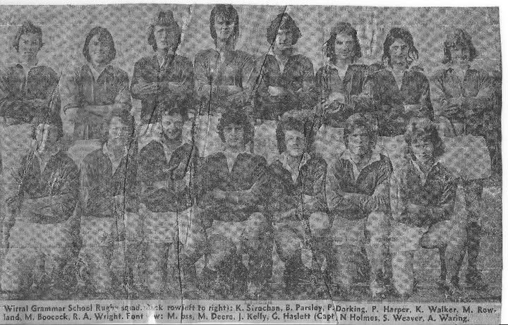
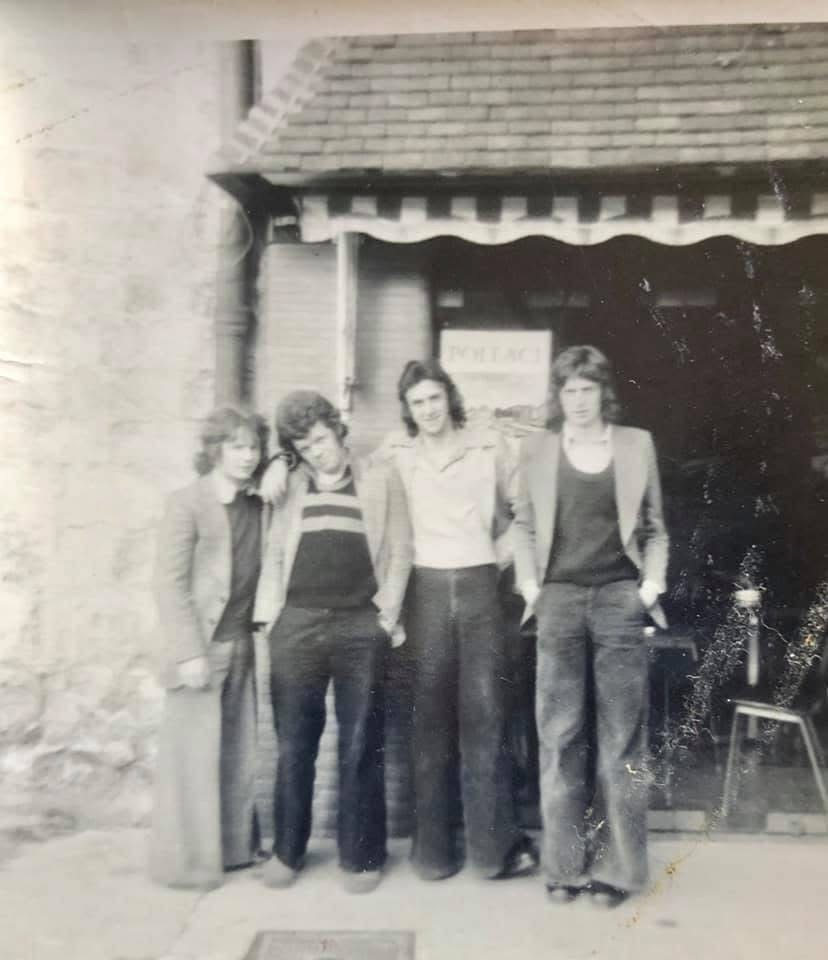
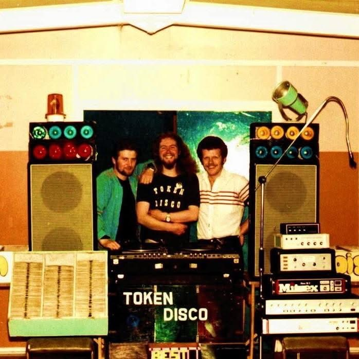
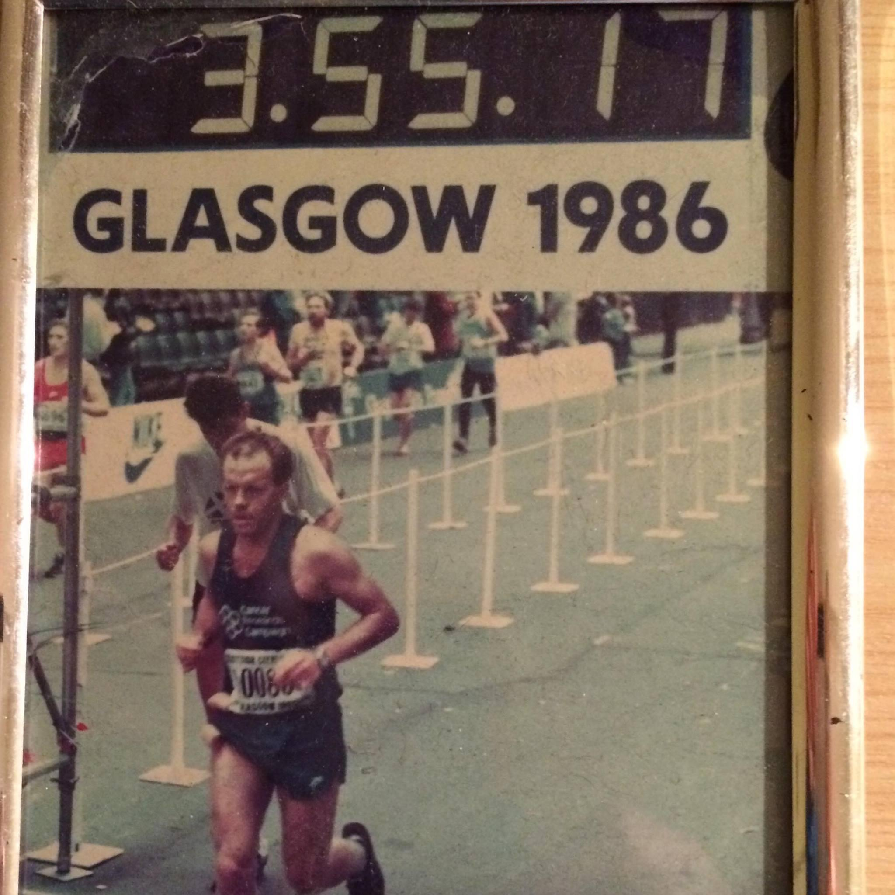
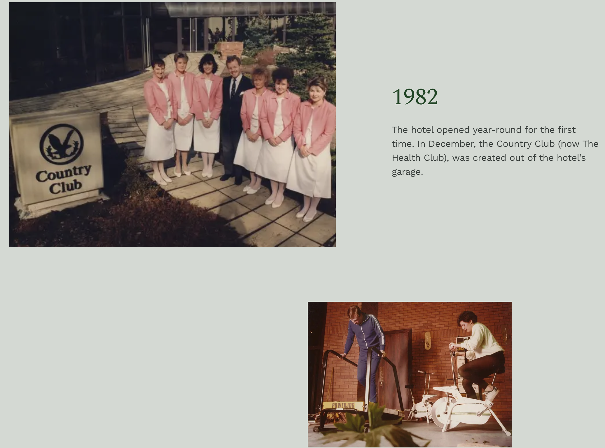
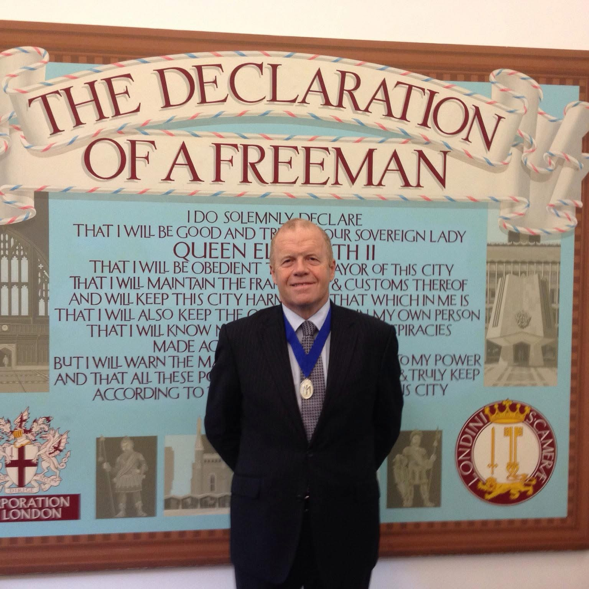
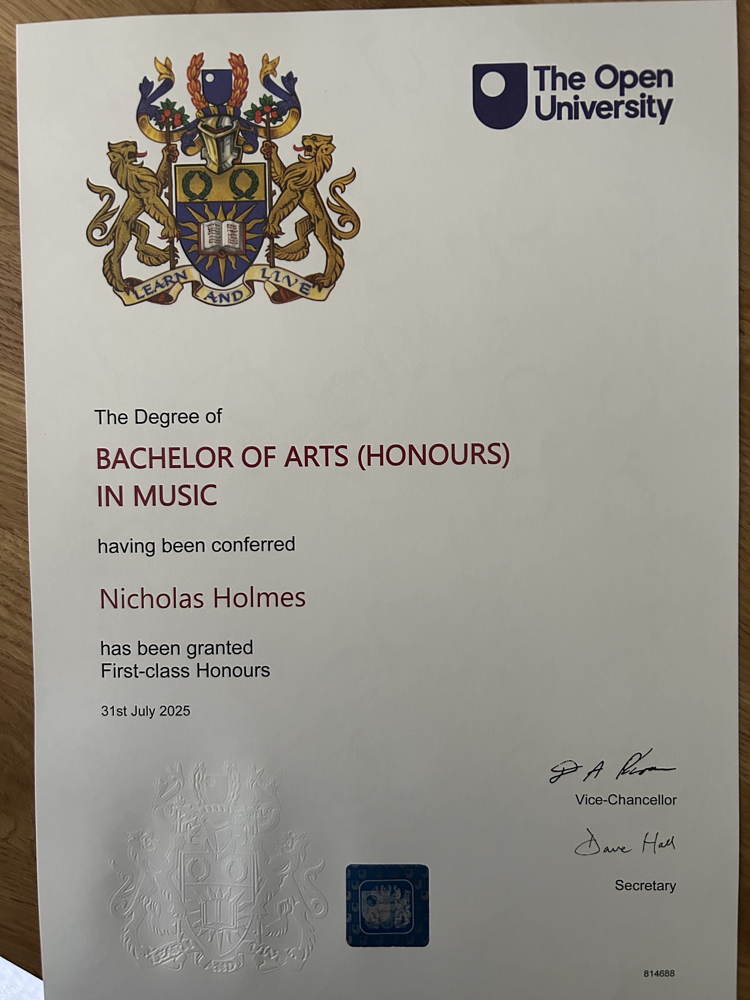

# Nick Holmes — Image Archive

This page accompanies the biographical record of **Nick Holmes (born 1957)** and presents a small archive of contemporaneous photographs referenced in the main legacy narrative.

Images are drawn from a mixture of **published local press**, **official ceremonies**, and **private contemporaneous photographs**, and are presented here for historical and family reference.

*This image archive will continue to grow as additional photographs are identified and digitised.*

---

## Education & youth

**Wirral Grammar School Rugby Team (c. 1974–1975)**  

Published local newspaper photograph showing the school rugby squad. Nick Holmes is named in the original caption.  
*Source: published contemporaneous*

**France Rugby Tour (c. 1975)**

Photograph taken during an overseas rugby tour while at Wirral Grammar School.  
*Source: private contemporaneous*

---

## Music (1970s)

**Rock group “Swag” – Wirral youth talent competition (mid-1970s)**

Local newspaper clipping featuring the band *Swag*, finalists in a Wirral youth talent competition organised by Bebington Youth Council.  
*Source: published contemporaneous*

**Local DJ work – Wirral (c. 1977–1980)**

Private photograph showing mobile disco equipment and collaborators during DJ work across the Wirral.  
*Source: private contemporaneous*

---

## Sport & endurance

**Sheffield Marathon (1982)**  
Completed in a sub-four-hour time.  
*Source: first-person record*

**Glasgow Marathon (1986)**

Finish photograph showing completion of the Glasgow Marathon.  
*Source: private contemporaneous*

---

## Hospitality career — Scotland

**Gleneagles Hotel (early 1980s)**  
Private photographs document Nick Holmes with colleagues during his time at Gleneagles. One photograph from 1982 shows him with his therapist team; another from the same year shows Elizabeth (later his wife) on an exercise bike.  
*Source: private contemporaneous; contextualised by official Gleneagles history*

**Gleneagles Hotel – early 1980s**

Photograph from Nick Holmes’ early career period at Gleneagles Hotel.  
*Source: private contemporaneous*
---

## Honours

**Freeman of the City of London**

Photograph taken at the formal admission ceremony as a Freeman of the City of London.  
*Source: private contemporaneous*

---

## Academic achievement

**The Open University — BA (Hons) Music (First-Class Honours), 2025**  
Student Academic Summary confirms award and classification.  
*Source: official documentary evidence*

Private photograph
*Source: private contemporaneous*
---

## Notes on use

- Images are presented for **historical reference**, not promotion.  
- Some images are published contemporaneously; others are private.  
- Higher-resolution originals may be held separately in the family archive.
